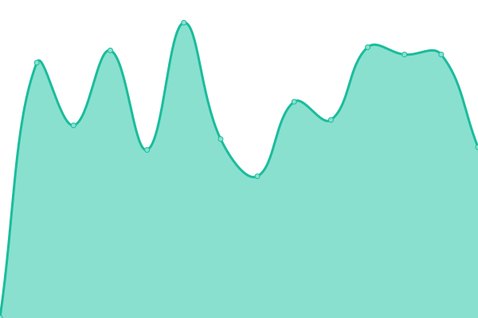
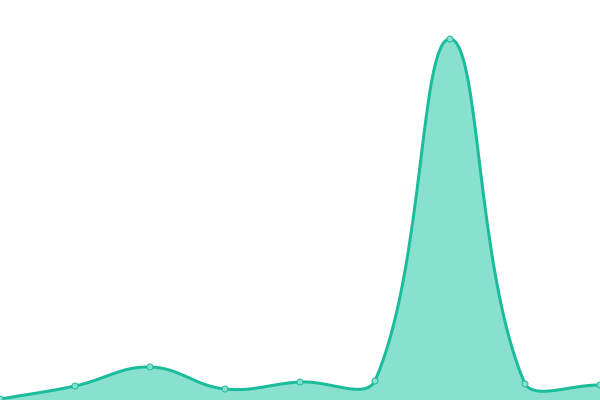
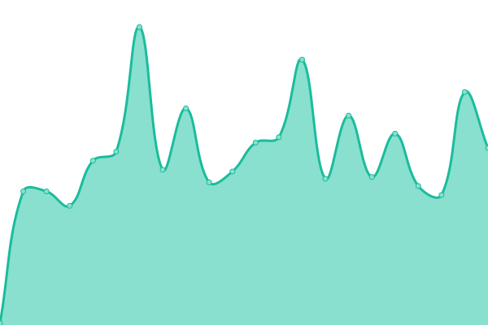
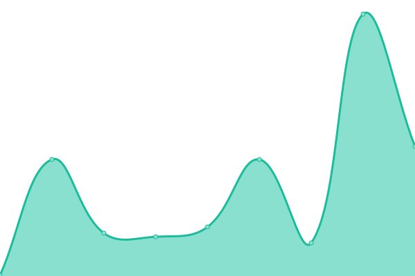

# [📈 Live Status](https://demo.upptime.js.org): <!--live status--> **🟧 Partial outage**

This repository contains the open-source uptime monitor and status page for [Sumit S. Chaure](https://demo.upptime.js.org), powered by [Upptime](https://github.com/upptime/upptime).

With [Upptime](https://upptime.js.org), you can get your own unlimited and free uptime monitor and status page, powered entirely by a GitHub repository. We use [Issues](https://github.com/Sumit-SC/uptime-webapp/issues) as incident reports, [Actions](https://github.com/Sumit-SC/uptime-webapp/actions) as uptime monitors, and [Pages](https://demo.upptime.js.org) for the status page.

<!--start: status pages-->
<!-- This summary is generated by Upptime (https://github.com/upptime/upptime) -->
<!-- Do not edit this manually, your changes will be overwritten -->
<!-- prettier-ignore -->
| URL | Status | History | Response Time | Uptime |
| --- | ------ | ------- | ------------- | ------ |
|  [Portfolio Page](sumit-sc.github.io) | 🟩 Up | [portfolio-page.yml](https://github.com/Sumit-SC/uptime-webapp/commits/HEAD/history/portfolio-page.yml) | 

 435ms
     
 | 

<a href="https://Sumit-SC.github.io/uptime-webapp/history/portfolio-page">88.06%</a>
    

|  [Portfolio Website](https://sumit.indevs.in) | 🟥 Down | [portfolio-website.yml](https://github.com/Sumit-SC/uptime-webapp/commits/HEAD/history/portfolio-website.yml) | 

 0ms
     
 | 

<a href="https://Sumit-SC.github.io/uptime-webapp/history/portfolio-website">0.00%</a>
    

|  [Google](https://www.google.com) | 🟩 Up | [google.yml](https://github.com/Sumit-SC/uptime-webapp/commits/HEAD/history/google.yml) | 

 100ms
     
 | 

<a href="https://Sumit-SC.github.io/uptime-webapp/history/google">100.00%</a>
    

|  [Wikipedia](https://en.wikipedia.org) | 🟩 Up | [wikipedia.yml](https://github.com/Sumit-SC/uptime-webapp/commits/HEAD/history/wikipedia.yml) | 

 167ms
     
 | 

<a href="https://Sumit-SC.github.io/uptime-webapp/history/wikipedia">100.00%</a>
    

<!--end: status pages-->

[**Visit My status website →**](http://sumit.indevs.in/uptime-webapp)

[**Visit Upptimes Demo status website →**](https://demo.upptime.js.org)

## 📄 License

- Powered by: [Upptime](https://github.com/upptime/upptime)
- Code: [MIT](./LICENSE) © [Anand Chowdhary](https://anandchowdhary.com), supported by [Pabio](https://pabio.com)
- Data in the `./history` directory: [Open Database License](https://opendatacommons.org/licenses/odbl/1-0/)
